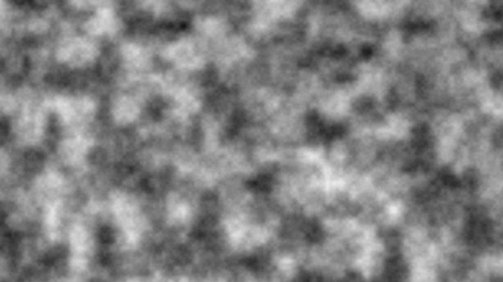
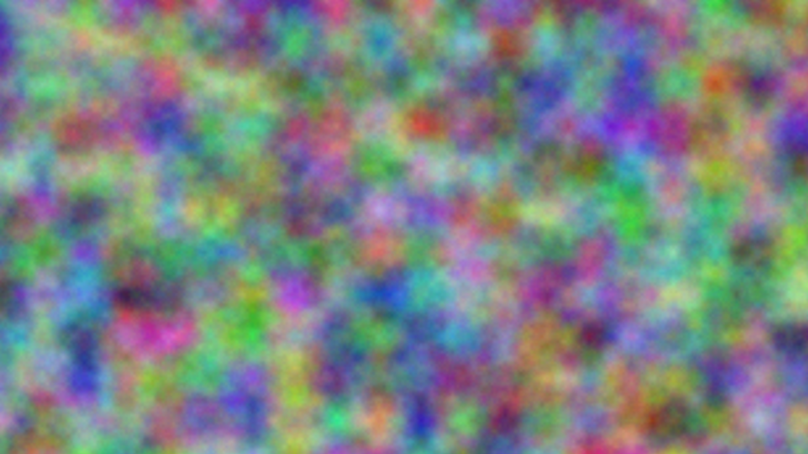
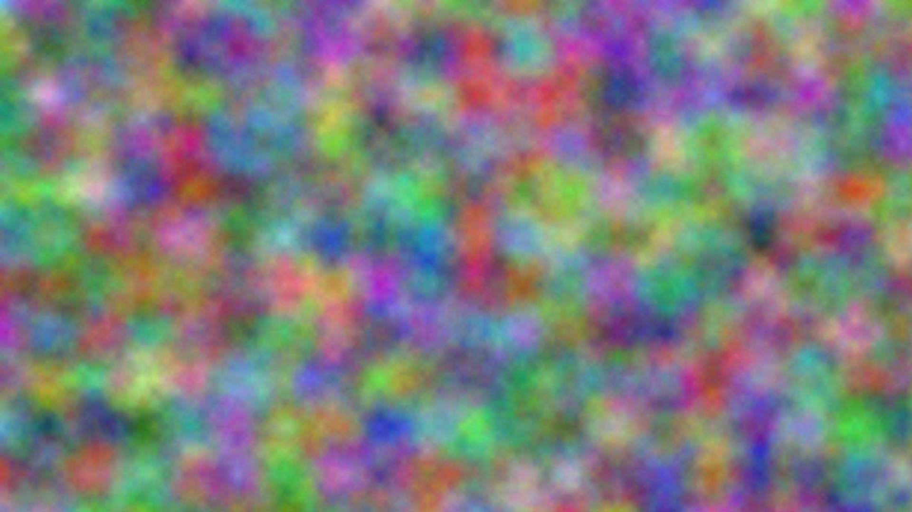
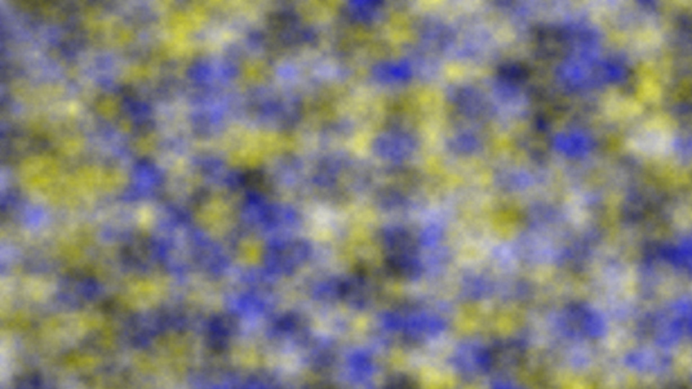

# rust-wp

This is Rust wallpaper generator using perlin noise. \
Made for fun. \
\
Generated wallpaper is 1920x1080 and a little bit colourful. \
You can tweak the code to your liking. \
\
Output file in `wallpaper.png`

## Usage

```sh
git clone https://gitlab.com/Boiiterra/rust-wp.git
cd rust-wp
cargo run
# file "wallpaper.png" will appear in directory
```

## Examples

[](.)
[](.)
[](.)
[](.)
